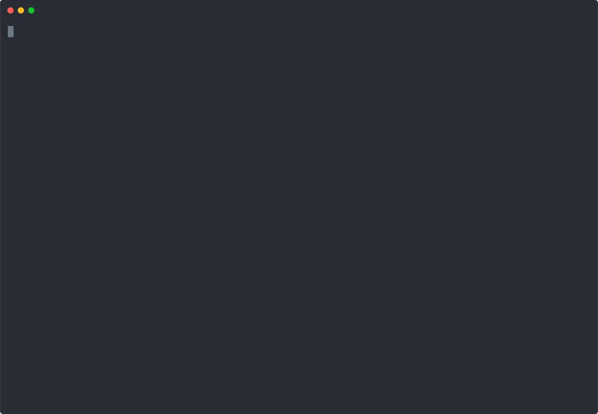

# TileYolo

**Serve GeoTIFFs as an XYZ tile API with zero configuration.**

Drop your TIFFs into subfolders by style and run `tileyolo` — it handles everything else.

## Usage

### Docker

Get up and running immediately! Organise a folder `data` with a subfolder according to the style, such as `./data/viridis`, to colour them against the `viridis` colour palette (Read [styling and folder structure](#styles--folder-structure) for customisation options):

```bash
./data
└── viridis
    ├── world-dem.tif
    └── treescape.tif
```
then run: 

```
docker run -v ./data:/app/data -p 8000:8000 ghcr.io/evanjt/evanjt/tileyolo:latest
```

You can then browse all of the loaded rasters by going to [http://localhost:8000/map](http://localhost:8000/map)


### Install

```bash
cargo install tileyolo
```

Or use as a library:

```bash
cargo add tileyolo
```

#### Dependencies

* GDAL
* Proj

### Cargo

1. `cd` into your data directory (parent of style subfolders).
2. Run:
   ```bash
   tileyolo
   ```
3. Point your XYZ-capable client (browser, QGIS, Leaflet, etc.) at:
   ```text
   http://localhost:8000/tiles/{layer}/{z}/{x}/{y}
   ```
   - **`{layer}`** is the TIFF filename (without extension).

TileYolo will auto-detect styles (`style.txt` or built-in palettes), handle no-data values, and serve tiles on port 8000.


## Styles & Folder Structure

Organize your GeoTIFFs into style-specific subfolders:

```text
./data/
├── default/
│   ├── layer1.tif
│   ├── layer2.tif
│   └── style.txt    # QGIS-exported colour stops
├── viridis/
│   ├── layer3.tif
│   └── layer4.tif   # uses built-in viridis palette
└── grayscale/
    └── layer5.tif   # no style.txt → linear grayscale
```

- **Custom styles**: Folders with a `style.txt` (QGIS export) use those exact colour stops.
- **Built-in palettes**: Folders named `viridis`, `magma`, `plasma`, `inferno`, `turbo`, `cubehelix_default`, `rainbow`, `spectral`, or `sinebow` apply the corresponding gradient.
- **Grayscale fallback**: Other folders without any style file render in linear grayscale.


#### QGIS `style.txt` Example

```text
# QGIS Generated Colour Map Export File
INTERPOLATION:INTERPOLATED
0,215,25,28,255,0
100,253,174,97,255,100
200,255,255,191,255,200
300,171,221,164,255,300
400,43,131,186,255,400
```

See [QGIS Raster Properties → Symbology → Colour Ramp](https://docs.qgis.org/3.40/en/docs/user_manual/working_with_raster/raster_properties.html#id13) for export instructions.

## Sample Output



## Configuration

TileYolo has minimal options:

```bash
$ tileyolo --help
Usage: tileyolo [OPTIONS]

Options:
  --data-folder <DIR>  Path to data folder [default: /home/.../data]
  -h, --help           Print help
  -V, --version        Print version
```

## Why TileYolo?

I needed a zero‑config, lightweight XYZ tile server for GeoTIFFs. TileYolo does just that: drag, drop, and go.

## Roadmap

- Speed up startup with caching
- Tile caching for performance
- S3 ~~and COG~~ support
- ~~Additional built-in palettes~~
- Contributions welcome

## Caveats

- Only **band 1** is served
- Output CRS is **EPSG:3857** (Web Mercator)
- Input TIFFs must define a CRS
- Tested on small to medium rasters; large rasters may require more resources
- Reprojection using [nearest neighbour](https://gdal.org/en/stable/programs/gdalwarp.html#cmdoption-gdalwarp-r)
